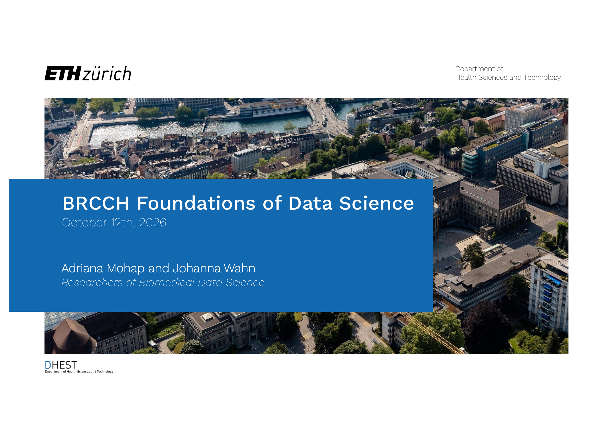

# Foundations of Data Science Tutorial

A comprehensive tutorial series covering the fundamentals of data science, machine learning, and biomedical data analysis using Python and Pandas.



## Open the Notebooks in Google Colab

No installation needed: click a badge below to open the notebook in Google Colab. The first code cell in each notebook downloads the data automatically.

| Part | Notebook | Open |
| :-- | :-- | :-- |
| 1 | Introduction to Python and pandas | [](https://colab.research.google.com/github/amohap/BRCCH-2026/blob/main/1_introduction_python_pandas_students.ipynb) |
| 2 | Data Visualization | [](https://colab.research.google.com/github/amohap/BRCCH-2026/blob/main/2_data_visualisation_students.ipynb) |
| 3 | Data Wrangling | [](https://colab.research.google.com/github/amohap/BRCCH-2026/blob/main/3_data_wrangling_students.ipynb) |
| 4 | Statistics | [](https://colab.research.google.com/github/amohap/BRCCH-2026/blob/main/4_statistics_students.ipynb) |
| 5 | Machine Learning | [](https://colab.research.google.com/github/amohap/BRCCH-2026/blob/main/5_machine_learning_heart_disease_students.ipynb) |

**Important:** to keep your work, save your own copy first with *File → Save a copy in Drive*.

## Course Overview

This tutorial is based on the **BRCCH Foundations of Data Science** lecture taught by Dr. Albert Belenguer-Llorens, Johanna Wahn, and Adriana Mohap from ETH Zurich's Biomedical Data Science Lab. The course provides a systematic introduction to data science concepts with practical applications in healthcare and biomedical research.

## Tutorial Contents

1. **Part I: Introduction to Python and Pandas Data Science**
2. **Part II: Data Visualization and Exploration**
3. **Part III: Data Wrangling**
4. **Part IV: Statistics**
5. **Part V: Introduction to Machine Learning Project**

### Dataset

- **Heart Disease Dataset** (`heart_disease_data.csv`)

  - 303 patient records with 13 clinical features
  - Features include age, sex, chest pain type, blood pressure, cholesterol, etc.
  - Target variable: heart disease diagnosis (binary classification)
  - Source: Cleveland Clinic Foundation data from the [UCI Machine Learning Repository](https://archive.ics.uci.edu/dataset/45/heart+disease) (Janosi, Steinbrunn, Pfisterer & Detrano, 1989; CC BY 4.0)

## Practical Notebooks

### 1. Python Refresher and Pandas Notebook

**Essential Python concepts for data science:**

- **Data Structures**: Working with Series and DataFrames
- **Data Creation**: From dictionaries, lists, arrays, and other sources
- **Indexing and Selection**: Using `[]`, `.loc[]`, and `.iloc[]` for data access
- **Data Inspection**: Methods for understanding your data structure and quality
- **Data Manipulation**: Column creation, mapping operations, and transformations
- **Missing Data Handling**: Detection, removal, and imputation strategies
- **Grouping and Aggregation**: Using `groupby()` for data analysis

### 2. Data Visualization Notebook

**Creating effective visualizations with matplotlib and seaborn:**

- **Matplotlib Foundations**: Figure and axes concepts, basic plotting, customization
- **Seaborn Statistical Plots**: Distribution plots, relationship plots, categorical visualizations
- **Visualization Best Practices**: Colorblind-friendly palettes, clear labeling, appropriate chart types
- **Practical Examples**: Using the heart disease dataset to create informative visualizations

### 3. Data Wrangling

**Preparing data for analysis with pandas:**

- **Loading & Inspection**: Reading the raw CSV, checking shape, and finding missing values
- **Missing Data**: Restricting the analysis to complete cases
- **Variable Types**: Converting integer-coded variables to labeled categoricals and casting types with astype()
- **Practical Examples**: Cleaning the Cleveland heart disease dataset

### 4. Statistics

**Working with real-world dataset:**

- **Mapping values to meaningful names**: sometimes the data needs additional work to make them ready to be analysed
- **Statistical tests**: normality and group comparison tests

### 5. Machine Learning Project

- **Problem Setup**: Defining the classification task and metrics
- **Data Preparation**: Automated EDA and preprocessing
- **Model Comparison**: Testing multiple algorithms
- **Hyperparameter Tuning**: Automated optimization
- **Model Evaluation**:  Comprehensive performance analysis

## Learning Objectives

By completing this tutorial, you will be able to:

1. **Understand Data Science Fundamentals**

   - Define data science and its applications
   - Distinguish between structured and unstructured data
   - Identify healthcare data sources and their characteristics
2. **Master Data Wrangling Skills**

   - Diagnose missing data mechanisms
   - Apply appropriate missing data handling strategies
   - Clean and transform datasets for analysis
3. **Work with Pandas Effectively**

   - Create and manipulate Series and DataFrames
   - Perform data indexing, selection, and filtering
   - Handle missing data and perform data transformations
4. **Create Effective Visualizations**

   - Generate informative statistical plots
   - Customize visualizations for clarity
   - Apply best practices for data presentation
5. **Apply Machine Learning Concepts**

   - Distinguish between supervised and unsupervised learning
   - Implement proper data splitting and cross-validation
   - Recognize and prevent overfitting
   


## Getting Started

### Prerequisites

- Basic Python knowledge
- Understanding of basic statistics

### Required Libraries

- pandas
- numpy
- matplotlib
- seaborn
- scipy
- scikit-learn
- joblib

## Usage Instructions

1. **Open the notebooks in order** (Part 1 to 5) using the Colab badges above. Each notebook builds on the previous one.
2. **Save a copy in your Drive** before you start working.
3. **Run the cells from top to bottom.** Exercises are marked with `# YOUR CODE HERE` or `#TODO`.
4. **Review the lecture materials** for the theoretical background.

To work locally instead, clone the repository and install the required libraries:

```bash
git clone https://github.com/amohap/BRCCH-2026.git
pip install pandas numpy matplotlib seaborn scipy scikit-learn joblib
```

## Enhanced ML Workflow Checklist

This tutorial implements a comprehensive machine learning workflow:

### Data Preparation

- ✅ Problem definition and metric selection
- ✅ Data acquisition and quality assessment
- ✅ Feature encoding (categorical/numeric preprocessing)
- ✅ Missing data diagnosis and handling
- ✅ Feature selection and engineering

### Model Development

- ✅ Stratified data splitting
- ✅ Cross-validation implementation
- ✅ Hyperparameter tuning with grid search
- ✅ Overfitting prevention techniques
- ✅ Model evaluation and validation

### Best Practices

- ✅ Preventing data leakage in preprocessing pipelines
- ✅ Proper cross-validation for robust performance estimates
- ✅ Documentation and code reproducibility

## Tutorial Structure

Each notebook builds on previous concepts:

- **Notebook 1** → Foundational Python and pandas intro
- **Notebook 2** → Data visualization
- **Notebook 3** → Data wrangling
- **Notebook 4** → Data statistical characterization
- **Notebook 5** → Complete ML workflow on real dataset

## Contact Information

**Course Instructor:**
Dr. Catherine Jutzeler
Assistant Professor of Biomedical Data Science
ETH Zurich
Email: Catherine.Jutzeler@hest.ethz.ch
Lab Website: https://bmds.ethz.ch/

## Additional Resources

- [Pandas Documentation](https://pandas.pydata.org/docs/)
- [Scikit-learn User Guide](https://scikit-learn.org/stable/user_guide.html)
- [Seaborn Gallery](https://seaborn.pydata.org/examples/index.html)
- [Matplotlib Tutorials](https://matplotlib.org/stable/tutorials/index.html)

## License

This tutorial is provided for educational purposes. Please refer to individual library licenses for usage restrictions.
